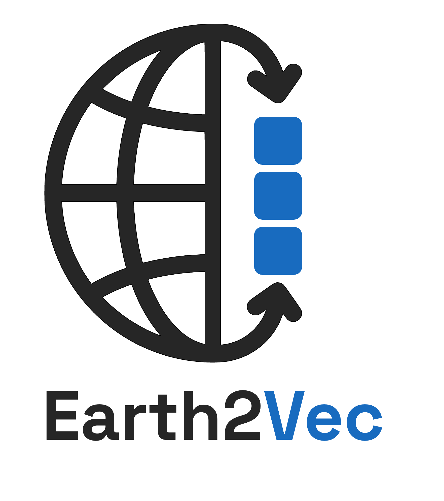

  

# Earth2Vec

**Earth2Vec** is a community-driven initiative dedicated to accelerating  
research and real‑world applications of Earth Observation (EO) embeddings.

**Earth2Vec** is a community-driven initiative dedicated to accelerating 
research and real‑world applications of Earth Observation (EO) embeddings.

We work toward unlocking the potential of EO embeddings by defining standards for data formats and benchmarking, 
exploring practical use cases, and fostering open-source collaboration across the community.
Earth2Vec brings together researchers, industry partners, and individual contributors. 

The community is supported by the EU‑Horizon project **Embed2Scale** (Horizon Europe Grant Agreement No. 101131841, with additional support from SERI and UKRI). 
Embed2Scale develops methods for EO and weather data federation using AI embeddings and, through initiatives such as Earth2Vec, supports evaluation, exchange, and continued advancement across the broader research ecosystem.

### How to join?
The community is open to everyone interested in the topic, just join our [Discord](https://discord.gg/Ym6ngDhgGH) to be added to the community. 
We share monthly meeting invitations there, and you can reach out in the channel to get them forwarded to your email.

### Recordings of past meetings:  

[23.01.2026](https://youtu.be/KO0P5ksqRRk)  MOSAIKS and Earth Embeddings, Esther Rolf  
[14.11.2025](https://youtu.be/tcBRSMDM8z4)  Learning Mental Maps in Neural Networks, Marc Rußwurm  
[10.10.2025](https://youtu.be/VnPDGp1ektI)  CORSA/Terrascope, Andreas Luyts, Vito  
[12.09.2025](https://youtu.be/drKctLX5-xA)  Introduction to AlphaEarth by Valerie Pasquarella, Google  
[08.08.2025](https://youtu.be/lO8A1wuXrMY)  Introduction to Clay 1.5 by Bruno Sánchez-Andrade Nuño, the Clay Foundation  
[11.07.2025](https://youtu.be/Ww-ua0ri18Y)  Embedding Exchange Formats  
[06.06.2025](https://youtu.be/XNuidNDdqmU)  Community Kickoff
